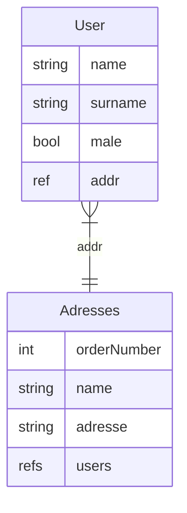
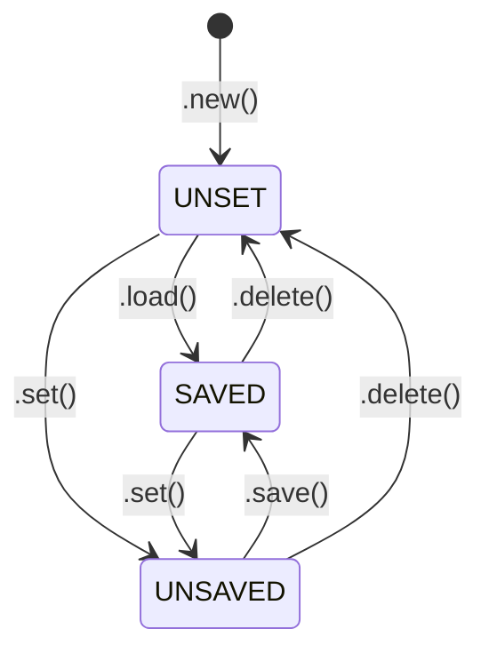

# Back Office Low Code (backo)


 

Jump to [Quickstart](#quickstart) for a basic setup.


## What is backo
It aims at providing a simple and efficient way to create a backend application that exposes a set of REST API routes. 


## Installation

```bash
pip install backo
```

## Quickstart

Here is a sample with a DB (storage full in yaml file) with users and adresses reference



It translates into Python code using Backo like following:

```python
from flask import Flask
from backo import Item, DBYmlConnector, Backoffice
from backo import Ref, RefsList, DeleteStrategy

# --- Storage for user
yml_users = DBYmlConnector(path="/tmp")
# --- Storage for addresses
yml_addr = DBYmlConnector(path="/tmp")

# -- Description of the backoffice
my_backoffice = Backoffice("myApp")

# -- Add the collection "users" into this backoffice (with a reference to the futur "addrs" collection)
my_backoffice.add_collection(
    "users",
    Item(
        {
            "name": String(),
            "surname": String(),
            "addr": Ref(coll="addrs", field="$.users", required=True),
            "male": Bool(default=True),
        },
        yml_users,
    ),
)
# -- Add the collection "addrs" into this backoffice (with reference to the "usres" collection)
my_backoffice.add_collection(
    "addrs",
    Item(
        {
            "name": String(),
            "address": String(),
            "users": RefsList(
                coll="users", field="$.addr", ods=DeleteStrategy.MUST_BE_EMPTY
            ),
        },
        yml_addr,
    ),
)


# Your flask application
flask = Flask(__name__)

# -- Add CRUD routes for this application
my_backoffice.add_routes(flask)

```

## Syntax


[backo](https://github.com/bwallrich/backo) use [stricto](https://github.com/bwallrich/stricto) for structured description language.

### Item

`Item` is the central class in Backo. 

It represents a database entity and includes all the methods required for CRUD operations: *Create*, *Read*, *Update*, and *Delete*.

A generic object is a [stricto](https://github.com/bwallrich/stricto) `Dict()` object.

`Item( description object , db connector )`

#### example

```python
# Describe what a 'cat' is
cat = Item(
        {
            "name": String( required=True, default='Felix'),
            "address": String(),
            "age" : Int()
        },
        db_connector_for_cat)

# Add the cat object into the backoffice object
backoffice.add_collection( "cats", cat )
```

> [!IMPORTANT]  
> Up to now no need to care about [_id](#_id).

| Method | Description |
| - | - |
| ```.create( data :dict )``` | Create a new `Item` in the database using the provided `data` dictionary.
| ```.save()``` | saves the current `Item` to the database. |
| ```.load( _id :str )``` | loads an `Item` from the database by its `_id`. |
| ```.reload()``` | reloads the current `Item` from the database. |
| ```.delete()``` | deletes the current `Item` from the database. |
| ```.new()``` | creates a new empty `Item` (must be populated with `.set()` and then saved). |
| ```.select()``` | retrieves a selection of `Item` from the database based on the selection criteria. |

For each function above, an error is triggered in case of something went wrong.

### Cardinalities
Relations cardinalities are expressed by the mean of `Ref()` and `RefsList()`:
* `Ref()`: for `0 or 1` or `exactly 1` relations.
* `RefsList()`: for `0 or more` or `1 or more` relations.

#### Options
| Option for Ref | Default | Description |
| - | - | - |
| ```coll=``` | None | the collection to make the ref |
| ```table=``` | None | similar to ```coll``` |
| ```field=``` | None | The reverse field in the targeted collection (use [selector](https://github.com/bwallrich/stricto?tab=readme-ov-file#selectors) to target it) |
| ```rev=``` | None | similar to ```field``` |
| ```ods=``` | None | *On Delete Strategy* see [ods](#deletion-strategies)|

And all options availables in [stricto String()](https://github.com/bwallrich/stricto?tab=readme-ov-file#string) fields.


#### Deletion strategies (`ods`)

ods define the behaviour of the database when a delete occure and the object contain some ```RefList```. For each  ```RefList```, you can define the strategy :

* ```DeleteStrategy.MUST_BE_EMPTY``` (by default)
Requires the RefList to be empty before allowing the object to be deleted.
If the RefList contains items, the deletion will be blocked and an error will be raised.

* ```DeleteStrategy.DELETE_REFERENCED_ITEMS```
When deleting the parent object, this strategy also deletes all objects referenced in the RefList.
[!Warning] Use with caution, as this causes cascading deletes and may remove many related objects unintentionally.

* ```DeleteStrategy.UNLINK_REFERENCED_ITEMS```
Instead of deleting the referenced objects, this strategy removes the reference to the deleted object from each referenced item.
This is commonly used for many-to-many relationships where you want to delete the parent object but keep the referenced objects intact, but simply cleaning up their links.


#### Relationship example: Books and Authors
An author can write 0 or many books.

A book can be written only by 1 author.

```python
# Authors write books
author = Item({
    'name' : String(),
    # An author may have written 0 or many books
    'books' : RefsList( coll='book', field="$.autor" )
}, db_connector)

# A book is written by on author
book = Item({
    ... # Some attibutes
    # A book may have 1 or more authors
    authors = RefsList( coll='author', field="$.books", required=True )
}, db_connector )
```


## Routes

Automatic routes creation provide the following resources

### GET /coll/\<collection name\>/\<_id\> \?_view=\<view name\>

```_view``` are defined in [stricto views](https://github.com/bwallrich/stricto?tab=readme-ov-file#views)

Return the object of this collection *by _id*.

```bash
curl -X GET 'http://localhost/myApp/coll/users/123'

# Equivalent (by default _view=client)
curl -X GET 'http://localhost/myApp/coll/users/123?_view=client'

# Another view
curl -X GET 'http://localhost/myApp/coll/users/123?_view=otherviewname'

```
Answers can be :

| code | data | Description |
| - | - | - |
| 200 | JSON object data | the requested item |
| 401 | None | you are not authorized to view this item |
| 404 | None | item not found |
| 500 | None | server-side error |

### GET /coll/\<collection name\>?\<query_string\>

Get a list of objects matching the query string. The query string can be with this format

| key | value | description |
| - | - | - |
| \<field\> | \<value\> | matches items where `<field>` equals `<value>`. Example: `surname=donald` finds all items where surname equals to "donald". |
| \<field\>.\<operator\> | \<value\> | matches items where `<field>` satisfies `<operator>` with `<value>`. Example: `age.$lt=12` finds items where age is less than 12. |
| \<field\>.\<subfield\> | \<value\> | Matches items where `<field>` is a nested dictionary containing `<subfield>` equal to `<value>`. Example: `address.number=1` matches items where address.number equals to 1. |


[list of available operators](https://github.com/bwallrich/stricto?tab=readme-ov-file#filtering-and-matching)


| key | value | default | description |
| - | - | - | - |
| \_view | string | "client" | selects the view ([stricto views](https://github.com/bwallrich/stricto?tab=readme-ov-file#views))  |
| \_page | int | - | sets the desired number of items per page in paginated data presentation |
| \_skip | int | - | skips the n-first items of the result list in paginated data presentation. |


The request returns a HTTP status `200` with that JSON object:

```python
{
    "result": # list of dict containing objects matched
    "total": # (int) total number of object matched
    "_view": # the _view given in the request
    "_skip": # the _skip given in the request
    "_page": # the _page given in the request
}
```

#### Example
Select all users whose name includes 'do' and present the result list with 10 items per page.
```bash
curl -X GET 'http://localhost/myApp/coll/users/?name.$re=do&_page=10'  
```

### POST /coll/\<collection name\>
Create a new item for the collection `collection name`.

#### Example
```bash
curl -X POST 'http://localhost/myApp/coll/users/' -d '{"name":"John","surname":"Rambo"}'
```

It returns the created *user* JSON object with a generated unique identifier `_id` and some _metadatas or an error otherwise.


### PUT /coll/\<collection name\>/\<_id\>
Modify an existing object whose id is `_id`.

#### Example
```bash
curl -X PUT 'http://localhost/myApp/coll/users/1234' -d '{"name":"Johnny"}'

```
Modify the users with _id *1234* and return the modified object.


### DELETE /coll/\<collection name\>/\<_id\>
Delete an existing object whose id is `_id`.

#### Example
```bash
curl -X DELETE 'http://localhost/myApp/coll/users/1234'

```
Delete the user that has _id = *1234*.


### PATCH /coll/\<collection name\>/\<_id\>
Partial change of an existing object whose id is `_id`.
Please refer to the [Stricto patch method](https://github.com/bwallrich/stricto?tab=readme-ov-file#patch).

#### Example
```bash
curl -X PATCH  'http://localhost/myApp/coll/users/1234' -d '{"op": "replace", "path" : "$.name", "value": "Gilda"}'
```

Partial modification of the user with _id *1234* with the patch.

Patch content can be a *list of patch operations*.


## Internal usage
Typical use case for users and theirs addresses.

```python
# Create an adress, save it in the DB and provide the object with a unique id.
moon_address = backoffice.addrs.create({"name": "moon", "address": "far"})

# Create a user with this address
astro = backoffice.users.create({"name": "neil", "surname": "amstrong", "addr": moon_address._id})

moon_address.users # -> return []
moon_address.reload() # reload data from the DB so that crossed references are updated
moon_address.users # -> return [ astro._id ]
```

### _id

You dont't have to care about *_ids* in your item description. Backo will alter schema to add `_id` for each Item (see [stricto schemas](https://github.com/bwallrich/stricto?tab=readme-ov-file#schemas) for details).

### _meta

the db_connector adds meta data to each item by [altering its schema](https://github.com/bwallrich/stricto?tab=readme-ov-file#schemas).


The provided *meta_data_handler* give this Dict() :

```python
Dict(
    {
        "ctime": Datetime(),
        "mtime": Datetime(),
        "created_by": Dict(
            {"user_id": String(), "login": String()}
        ),
        "modified_by": Dict(
            {"user_id": String(), "login": String()}
        ),
    },
),
```

## Workflow and events

Each Item has a specific workflow and triggers specific events.

### workflow

The defined states for each item are following:

| State | descripion |
| - | - |
| UNSET | The Item result of a ```.new()``` function. It can't be saved in this state |
| UNSAVED | The Item has been modified and must be saved |
| SAVED | The Item is saved in the DB and has not been changed since last save |





### Events
The following events are triggered when the functions above are called:

| function | event before | event after |
| - | - | - |
| .load() |  | "loaded" |
| .save() |"before_save" | "saved" |
| .delete() | "before_delete" |  |
| .create() | None | "created" |

#### Example
Below is a simple use case on how to use these events:

```python
        def rip( event_name, root, me, **kwargs ):
            """
            event_name = "before_delete"
            root = cat Item
            me = cat Item too
            """
            # Do what you want

        cat = Item( {
                'name' : String()
                'birth' : Datetime()
            }
            on=[ ( "before_delete", rip ) ]
        )
```

## Transactions

*Soon*

## CurrentUser

*Soon*

## Logs

The log system is based on [logging Python module](https://docs.python.org/3/library/logging.html)

You must first design your logging system with handlers. Then you can write the logs outputs.

### Example

```python
import logging
from backo import log_system

# To write all file to stderr
log_system.add_handler( log_system.set_streamhandler() )

# To write in a file
log_system.add_handler( log_system.set_filehandler("/var/log/mylog.log") )

# Set the level 
log_system.setLevel( logging.INFO )

# create your own sub logger with its specific logging level
log = log_system.get_or_create_logger("custom")
log.setLevel(loggind.DEBUG)

log.debug("hey this is my first debug message")

```

### Advanced use

You can select a specific ```logger``` and modify it by adding/removing handlers and changing its level.

```python
log = log_system.get_or_create_logger("custom")
log.setLevel(loggind.DEBUG)
log.addHandler ( my_own_handler )
# ...
```

### current loggers

Currently available loggers are :

| logger | description |
| - | - |
| backoffice | The main Backoffice system |
| Item | The database itself (CRUD operations ) |
| ref | Ref and RefsList objects |
| transaction | transactions and roolback |
| yml | yaml database connector |


## Tests & co

For personal use only.

```bash
# all tests
python -m unittest tests
# or for a specific test
python -m unittest tests.TestDict.test_simple_type

# reformat
python -m black .

# pylint
pylint $(git ls-files '*.py')

# coverage
coverage run -m unittest tests
coverage html # report under htmlcov/index.html
firefox htmlcov/index.html

```


### Building a new release

For personal use only.

```bash
# Modify changelog
# modify pyproject.toml
git add -u
git commit -am 'preparing 0.0.x'
git push
git tag -a 0.0.x -m '0.0.x'
git push origin tag 0.0.x

# publish a new relase in github interface, based on tag 
```
