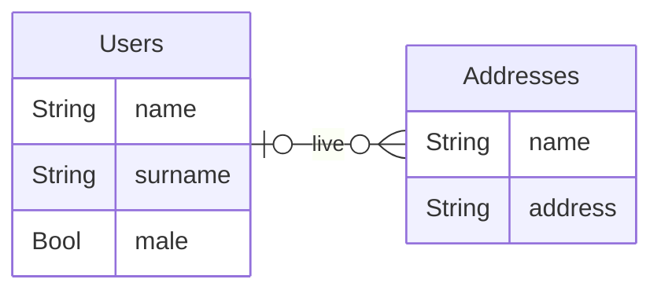
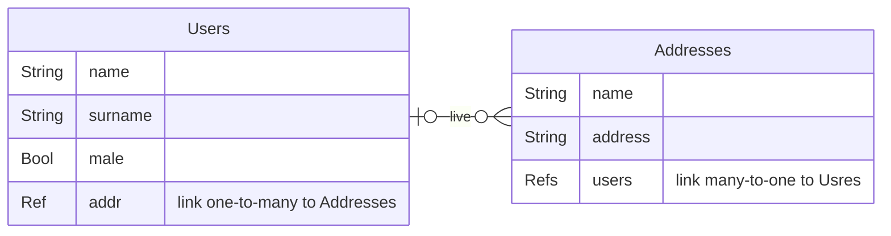
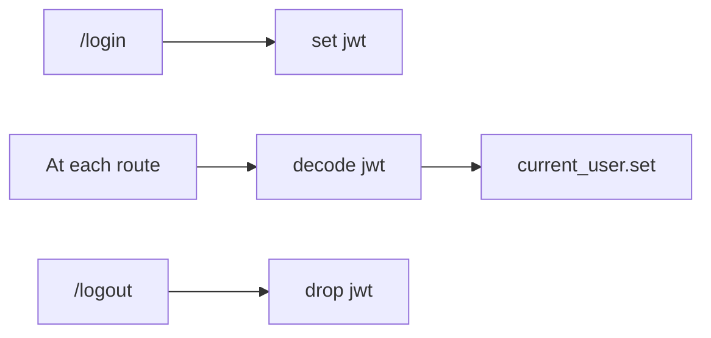
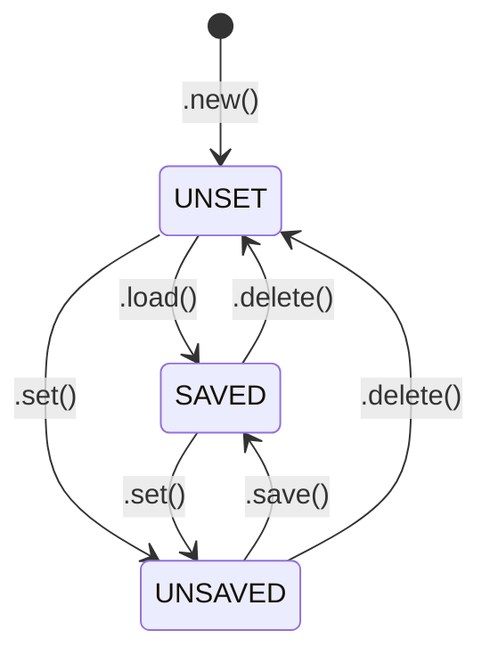

# Back Office Low Code (backo)


 

Jump to [Quickstart](#quickstart) for a basic setup.


See [Documentation](https://backo.readthedocs.io/en/latest/) for all details


## What is backo
It aims at providing a simple and efficient way to create a backend application that exposes a set of REST API routes. 


## Installation

```bash
pip install backo
```

## Quickstart

Here is a sample with a DB (storage full in yaml file) with users to adresses reference

Imagine this Entity Relationship (users ar living in exactly one address, but zero onr more user can live at the same address)


```mermaid
erDiagram
    direction LR
    classDef className fill:#f9f,stroke:#333,stroke-width:4px
    Users |o--o{ Addresses : live
    Users {
        String name
        String surname
        Bool male
    }
    Addresses {
        String name
        String address
    }
```

You only will add [Ref](#cardinalities) and [Refs](#cardinalities) to exprime the relationship. 


```mermaid
erDiagram
    direction LR
    classDef className fill:#f9f,stroke:#333,stroke-width:4px
    Users |o--o{ Addresses : live
    Users {
        String name
        String surname
        Bool male
        Ref addr "link one-to-many to Addresses"
    }
    Addresses {
        String name
        String address
        Refs users "link many-to-one to Usres"
    }
```


It translates into Python code using Backo like following:

```python
from flask import Flask
from backo import Item, DBYmlConnector, Backoffice, Collection, Item
from backo import Ref, RefsList, DeleteStrategy

# --- Storage for user
yml_users = DBYmlConnector(path="/path_to_users")
# --- Storage for addresses
yml_addr = DBYmlConnector(path="/path_to_addresses")

# -- Description of the backoffice
my_backoffice = Backoffice("myApp")

# -- Add the collection "users" into this backoffice (with a reference to the futur "addrs" collection)
coll_users = Collection( 
    "users",
    Item({
        "name": String(),
        "surname": String(),
        "addr": Ref(coll="addrs", field="$.users", required=True),
        "male": Bool(default=True),
    }),
    yml_users,
)
my_backoffice.add_collection(coll_users)

# -- Add the collection "addrs" into this backoffice (with reference to the "usres" collection)
coll_addrs = Collection(
    "addrs",
    Item(
        {
            "name": String(),
            "address": String(),
            "users": RefsList(
                coll="users", field="$.addr", ods=DeleteStrategy.MUST_BE_EMPTY
            ),
        },
    ),
    yml_addr,
)
my_backoffice.register_collection(coll_addrs)

# Your flask application
flask = Flask(__name__)

# -- Add CRUD routes for this application
my_backoffice.build_routes(flask)

```


## Item

`Item` is the central class in Backo. 

It represents a database entity and includes all the methods required for CRUD operations: *Create*, *Read*, *Update*, and *Delete*.

A generic object is a [stricto](https://github.com/bwallrich/stricto) `Dict()` object.


`Item( description object )`

### example

```python
# Describe what a 'cat' is
cat_item = Item(
        {
            "name": String( required=True, default='Felix'),
            "address": String(),
            "age" : Int()
            # And so on...
        })

# --- Storage for cats
db_for_cats = DBMongoConnector(
    connection_string="mongodb://localhost:27017/my_database", collection="Cate"
)


# Add the cat object into the Collection object by adding a name and a db connector
cats = Collection("cats", cat_item, db_for_cats)

# Then add collection to the backoffice
backoffice.register_collection( "cats", cats )
```

> [!IMPORTANT]  
> no need to care about [_id](#_id).

### Methods

| Method | Description |
| - | - |
| ```.create( data :dict )``` | Create a new `Item` in the database using the provided `data` dictionary.
| ```.save()``` | saves the current `Item` to the database. |
| ```.load( _id :str )``` | loads an `Item` from the database by its `_id`. |
| ```.reload()``` | reloads the current `Item` from the database. |
| ```.delete()``` | deletes the current `Item` from the database. |
| ```.new()``` | creates a new empty `Item` (must be populated with `.set()` and then saved). |
| ```.select()``` | retrieves a selection of `Item` from the database based on the selection criteria. |

For each function above, an error is triggered in case of something went wrong.

## Cardinalities
Relations cardinalities are expressed by the mean of `Ref()` and `RefsList()`:
* `Ref()`: for `0 or 1` or `exactly 1` relations.
* `RefsList()`: for `0 or more` or `1 or more` relations.


| Item A | Item B | description |
| -- | -- | -- |
| <kbd>Ref</kbd> | <kbd>Ref</kbd> | 0 or One to one |
| <kbd>Ref</kbd> | <kbd>RefsList</kbd> | 0 or One to many |
| <kbd>Ref(require=True)</kbd> | <kbd>RefsList</kbd> | One to many |
| <kbd>RefsList</kbd> | <kbd>RefsList</kbd> | Many to many |


### RefsList

* <kbd>ofs=</kbd> On Fill Strategy : fill the value ?
  * ```FillStrategy.FILL``` (by default) fill it
  * ```FillStrategy.NOT_FILL``` just keep ref

* <kbd>ods=</kbd> On Delete Strategy : what append when delete this item ?
  * ```DeleteStrategy.MUST_BE_EMPTY``` (by default) drop only if empty
  * ```DeleteStrategy.DELETE_REFERENCED_ITEMS``` drop all 
  * ```DeleteStrategy.UNLINK_REFERENCED_ITEMS``` references are lost


#### Options

| Option for Ref | Default | Description |
| - | - | - |
| <kbd>coll=</kbd> | None | the collection to make the ref |
| <kbd>field=</kbd> | None | The reverse field in the targeted collection (use [selector](https://github.com/bwallrich/stricto?tab=readme-ov-file#selectors) to target it) |
| <kbd>ods=</kbd> | ```DeleteStrategy.MUST_BE_EMPTY``` | *On Delete Strategy* see [ods](#deletion-strategies-ods)|
| <kbd>ofs=</kbd> | ```FillStrategy.FILL``` | *On Fill Strategy* |

And all options availables in [stricto String()](https://github.com/bwallrich/stricto?tab=readme-ov-file#string) fields.


#### Deletion strategies (`ods`)

ods define the behaviour of the database when a delete occure and the object contain some <kbd>RefList</kbd>. For each  <kbd>RefList</kbd>, you can define the strategy :

* ```DeleteStrategy.MUST_BE_EMPTY``` (by default)
Requires the RefList to be empty before allowing the object to be deleted.
If the RefList contains items, the deletion will be blocked and an error will be raised.

* ```DeleteStrategy.DELETE_REFERENCED_ITEMS```
When deleting the parent object, this strategy also deletes all objects referenced in the RefList.
[!Warning] Use with caution, as this causes cascading deletes and may remove many related objects unintentionally.

* ```DeleteStrategy.UNLINK_REFERENCED_ITEMS```
Instead of deleting the referenced objects, this strategy removes the reference to the deleted object from each referenced item.
This is commonly used for many-to-many relationships where you want to delete the parent object but keep the referenced objects intact, but simply cleaning up their links.


### Example

Relationship example: Books and Authors

* An author can write 0 or many books.
* A book can be written only by 1 author.

```python
# Authors write books
an_author = Item({
    'name' : String(),
    # An author may have written 0 or many books
    'books' : RefsList( coll='books', field="$.autor" )
})

# A book is written by an author
a_book = Item({
    ... # Some attibutes
    # A book may have 1 or more authors
    author = RefsList( coll='authors', field="$.books", required=True )
})
```
## Collection

A collection is composed by :
1. an [Item](#item)
2. a connector to a DB (DBConnector)
3. Some rights

> [!IMPORTANT]  
> A collection must be registered to a backoffice (with .register_collection() call)

A collection can have :
1. Some [Actions](#action)
2. Some [Selections](#selection)


See [routes](#routes) for resulting RESTFull api routes


### example

```python
from backo import Collection, DBMongoConnector, current

connector = DBMongoConnector(
    connection_string="mongodb://localhost:27017/media_library", collection="Books"
)
def can_delete(right_name: str, book: Item) -> bool:
    """Check if can delete a book"""
    if current_user.has_role(["ADMIN", "EMPLOYEE"]):
        return True
    return False

books = Collection(
    "books",
    books_item,
    connector,
    can_create=True,
    can_modify=True,
    can_delete=can_delete,
)
```

### rights

a right is a function (or a lambda) with thoses parameters, and must return a bool.

```python
def your_function_name(right_name: str, o: Item) -> bool:

```

| right | description |
| -- | -- |
| can_read | Check if the collection can be read |
| can_modify | Check if some elements in the collection can be modified |
| can_delete | Check if some elements in the collection can be deleted |


## Action


An action represent some modifications to an Item witch is more complex than just a PATCH/PUT (modification).

An action is compose by :
1. an [Stricto Dict](https://github.com/bwallrich/stricto?tab=readme-ov-file#dict)
2. a function
3. Some rights

> [!IMPORTANT]  
> An action must be registered to a collection (with .register_action() call)


### example

This is an action to *borrow a book*, with a start time at daytime.
(all collections ar not described)

```python

def borrow(action: Action, book: Item) -> None:
    """borrow the book"""
    book.borrow.user = action.user_id
    book.borrow.date = datetime.now().replace(microsecond=0)
    book.borrow.return_date = action.return_date
    book.save()


def can_borrow(right_name: str, book: Item) -> bool:
    """Tel if current_user can execute the borrow action
    """
    if current_user.has_role("EMPLOYEE"):
        return True
    return False


def can_see_borrow_action(right_name: str, book: Item) -> bool:
    """Tel the borrow action is a nonsense ?
    """
    return not book.borrowed
#
# Definition of the action
borrow_action = Action(
    {
        "user_id": String(require=True), 
        "return_date": Datetime(require=True)
    },
    borrow,
    can_execute=can_borrow,
    exists=can_see_borrow_action,
)

# Add the action to the book collection
books.register_action("borrow", borrow_action)

```

### rights for actions

a right is a function (or a lambda) with thoses parameters, and must return a bool.

```python
def your_function_name(right_name: str, o: Item) -> bool:

```

| right | description |
| -- | -- |
| can_execute | Check if [current_user](#current_user) can execute the action |
| can_see|exists | Check if this action is a available for this item |


### routes


See [actions routes](#actions-routes) for resulting RESTFull api routes


## Selection


A selection is a *named* list of Items with sub elements provided by a [path](https://github.com/bwallrich/stricto#selectors).

An selection is compose by :
1. a list of [selectors](https://github.com/bwallrich/stricto#selectors)
2. a [filter](https://github.com/bwallrich/stricto#matching)
3. Some rights

> [!IMPORTANT]  
> A selection must be registered to a collection (with .register_selection() call)


### example

This is a selection of borrowed books
(all collections ar not described)

```python
# Les livres empruntés
borrowed_book_select = Selection(
     [ "$.title", "$.borrow.user.login" ], 
     filter={ 'borrowed' : True }
     can_read=...
     )
books.register_selection("borrowed", borrowed_book_select)
```

And to call the selection...

```bash
curl -X GET 'http://localhost/media_library/coll/books/_selections/borrowed' 
  '{"result": [
     ["666", "Docker et plaisir", "Wallrich"], 
     ["1234", "Martine chez Epstein", "Lang"]
    ],
    "total": 2, "_skip": 0, "_page": 10}'
curl -X GET 'http://localhost/media_library/coll/books/_selections/borrowed?title.$reg=Martine'
```


### rights for selections

a right is a function (or a lambda) with thoses parameters, and must return a bool.

```python
def your_function_name(right_name: str, o: Item) -> bool:

```

| right | description |
| -- | -- |
| can_read | Check if [current_user](#current_user) can do the selection |


### routes


See [actions routes](#actions-routes) for resulting RESTFull api routes


## Ref and RefsList

See [Cardinalities](#cardinalities)

## Authentication

### General

Authentication is not managed by backo. You have to do the auth by yourself. and provide two things :

1. One or more authentication methode which set a ```jwt token```
2. A *verify function* wich read the ```jwt token``` and populate the [current_user](#current_user).

> [!IMPORTANT]  
> The *verify function* must be passed as args to .build_routes() call



```mermaid
flowchart LR
    login[ /login ]
    route[At each route]
    setjwt[ set jwt ]
    decjwt[ decode jwt ]
    set[ current_user.set ]
    logout[ /logout ]
    dropjwt[drop jwt]

    login --> setjwt
    route --> decjwt
    decjwt --> set
    logout --> dropjwt

```

### Example

This is an short and uncompleted example to authenticate and fill [current_user](#current_user).

first, the login part. a `/login` route in flas to make the login, and return a jwt

```python
app = Flask(__name__)
app.secret_key = "super secret key"
# Set the login route
@app.route("/login", methods=["POST"])
def login():
    """
    login load the user from the DB, verify the password and if
    Ok generate a JWT an return it to the client.
    At this point, current_user is not used.
    """
    d = request.json
    login = d["login"]
    password = d["password"]
    # find the user by your way
    user = load_from_db_by_login( login )
    # Do the check of the password
    if not user.check_password( password ):
      return jsonify({"message": "Invalid email or password"}), 401
 
    token = jwt.encode(
        {
            "exp": datetime.now(timezone.utc) + timedelta(hours=1),
            "user_id": user._id ,
        },
        "myappsecretkey",
        algorithm="HS256",
    )
    response = make_response(json.dumps({"login": "ok"}))
    response.set_cookie("jwt_token", token)
    return response
```

Second par : The decorator for authenticate the route and fill [current_user](#current_user)

```python
def token_required(f):
    @wraps(f)
    def decorated(*args, **kwargs):
        token = request.cookies.get("jwt_token")
        if not token:
            return jsonify({"message": "Token is missing!"}), 401
        try:
            data = jwt.decode(token, "myappsecretkey", algorithms=["HS256"])
        except:  # pylint: disable=bare-except
            return jsonify({"message": "Token is invalid!"}), 401

        # Load the user from the DB and fill current_user
        # we supose roles are store in your user_db
        user = load_from_db_by_id( data["user_id"] )
        current_user.set( { "_id" : user._id, "login" : user.login, "roles" : user.roles })

        return f(*args, **kwargs)
    return decorated
```

Then pass the function as args when you build routes.

```python
myapp.build_routes(flask, "", check_user_token)
```

## current_user

`current_user`is a object containing information of the authenticated user currently connected.

### usage

```python
# anywhere in your code
from backo import current_user

print(current_user._id) # The id of the current connected user
print(current_user.login) # A login name or whatever you store as "login"

# check if the user has the given role
if current_user.has_role('teamManager'):
  return True
```

### How to set values to the current_user ?

`backo` doesnt manage authentication, because there is so much way to authenticate a user (or an app). So you have to do the auth by yourself.

However, using jwt is a goot solution. See [Authentication](#authentication) for that.


### current_user api

`current_user` is a very simple [Stricto Dict](https://github.com/bwallrich/stricto?tab=readme-ov-file#dict) (but can be [extended](#extend-current_user)). It contains :

| key | type | usage |
| - | - | - |
| _id | [Stricto String()](https://github.com/bwallrich/stricto?tab=readme-ov-file#string) | the _id of the user. 
| login | [Stricto String()](https://github.com/bwallrich/stricto?tab=readme-ov-file#string) | the login or whatever you store . 
| roles | [Stricto List( String() )](https://github.com/bwallrich/stricto?tab=readme-ov-file#list) | the list of roles for this users. A *role* is a kid of group the user belongs to | 
| has_role() | function | return True or false to the role givent in param | 
| reset() | function | change the current_user object type. See [extend current_user](#extend-current_user) for that| 


### extend current_user

You can extend `current_user`, adding stuff in its schema, functions... etc.


```python
from backo import current_user, CurrentUser, CurrentUserWrapper

class MyCurrentUser(CurrentUser):


      def __init__(self, obj: CurrentUser):

        CurrentUser.__init__(self, obj)
        self.add_to_model( 'email' , String() )


    """
    a new class child of CuurrentUser
    """
    def my_function(self):
        """
        a Dummy function
        """
        return(f"user {self.login} ({self._id})")

current_user.reset(MyCurrentUser())

# Later in the code
current_user.email = "toto@titi.com"
current_user.my_function() # return the string "user ..."
```


## Routes

When you call

```python
mybackoffice.build_routes(flask)
```
Api routes are generated

### CRUD Routes
#### GET \<my-app-name\>/\<collection name\>/\<_id\> \?_view=\<view name\>

```_view``` are defined in [stricto views](https://github.com/bwallrich/stricto?tab=readme-ov-file#views)

Return the object of this collection *by _id*.

```bash
curl -X GET 'http://localhost/myApp/users/123'

# Equivalent (by default _view=client)
curl -X GET 'http://localhost/myApp/users/123?_view=client'

# Another view
curl -X GET 'http://localhost/myApp/users/123?_view=otherviewname'

```
Answers can be :

| code | data | Description |
| - | - | - |
| 200 | JSON object data | the requested item |
| 401 | None | you are not authorized to view this item |
| 404 | None | item not found |
| 500 | None | server-side error |

#### GET \<my-app-name\>/\<collection name\>?\<query_string\>

Get a list of objects matching the query string. The query string can be with this format

| key | value | description |
| - | - | - |
| \<field\> | \<value\> | matches items where `<field>` equals `<value>`. Example: `surname=donald` finds all items where surname equals to "donald". |
| \<field\>.\<operator\> | \<value\> | matches items where `<field>` satisfies `<operator>` with `<value>`. Example: `age.$lt=12` finds items where age is less than 12. |
| \<field\>.\<subfield\> | \<value\> | Matches items where `<field>` is a nested dictionary containing `<subfield>` equal to `<value>`. Example: `address.number=1` matches items where address.number equals to 1. |


[list of available operators](https://github.com/bwallrich/stricto?tab=readme-ov-file#filtering-and-matching)


| key | value | default | description |
| - | - | - | - |
| \_view | string | "client" | selects the view ([stricto views](https://github.com/bwallrich/stricto?tab=readme-ov-file#views))  |
| \_page | int | - | sets the desired number of items per page in paginated data presentation |
| \_skip | int | - | skips the n-first items of the result list in paginated data presentation. |


The request returns a HTTP status `200` with that JSON object:

```python
{
    "result": # list of dict containing objects matched
    "total": # (int) total number of object matched
    "_view": # the _view given in the request
    "_skip": # the _skip given in the request
    "_page": # the _page given in the request
}
```

##### Example
Select all users whose name includes 'do' and present the result list with 10 items per page.
```bash
curl -X GET 'http://localhost/myApp/users/?name.$re=do&_page=10'  
```

#### POST \<my-app-name\>/\<collection name\>
Create a new item for the collection `collection name`.

##### Example
```bash
curl -X POST 'http://localhost/myApp/users/' -d '{"name":"John","surname":"Rambo"}'
```

It returns the created *user* JSON object with a generated unique identifier `_id` and some _metadatas or an error otherwise.


#### PUT /\<my-app-name\>/\<collection name\>/\<_id\>
Modify an existing object whose id is `_id`.

##### Example
```bash
curl -X PUT 'http://localhost/myApp/users/1234' -d '{"name":"Johnny"}'

```
Modify the users with _id *1234* and return the modified object.


#### DELETE /\<my-app-name\>/\<collection name\>/\<_id\>
Delete an existing object whose id is `_id`.

##### Example
```bash
curl -X DELETE 'http://localhost/myApp/users/1234'

```
Delete the user that has _id = *1234*.


#### PATCH /\<my-app-name\>/\<collection name\>/\<_id\>
Partial change of an existing object whose id is `_id`.
Please refer to the [Stricto patch method](https://github.com/bwallrich/stricto?tab=readme-ov-file#patch).

##### Example
```bash
curl -X PATCH  'http://localhost/myApp/users/1234' -d '{"op": "replace", "path" : "$.name", "value": "Gilda"}'
```

Partial modification of the user with _id *1234* with the patch.

Patch content can be a *list of patch operations*.

### Validation routes

#### POST /\<my-app-name\>/\<collection name\>/_check

Check the validity a field of the item

Please refer to [stricto selectors](https://github.com/bwallrich/stricto#selectors) for more details on selectors.

get must provide a json structure in the body :

| field | type | descrimtion |
| -- | -- | -- |
| item | dict | the data to check. It can be partial, see examples belowv |
| path | string | the field to check in the item. This is a selector. Please refer to [stricto selectors](https://github.com/bwallrich/stricto#selectors) for more details |

The answer is a status 200 message with a json structure :

| field | type | descrimtion |
| -- | -- | -- |
| error | string or null | if null ther is no error, otherwise the error message |


Examples :


```bash
curl -X POST 'http://localhost/myApp/users/_check' -d '{ "item" : { "name" : "John", "surname" : 32 }, "path" : "$.surname" }'
# will check surname an return a response.data like 
{
    'error' : "Must be a string"
}
```

The response is a *status 200* even if the check return an error. The request is correct.

```bash
curl -X POST 'http://localhost/myApp/users/_check' -d '{ "item" : { "surname" : "Johnny" }, "path" : "$.surname" }' 
# will check surname an return a response.data like 
{
    'error' : null
}


curl -X GET 'http://localhost/myApp/users/_check' -d '{ "item" : { "name" : 23, "surname" : "Johnny" }, "path" : "$.surname" }'
# (only the surname is tested. don't car if name is correct or not)
{
    'error' : null
}
```

### Actions routes

Each collection has routes for its actions.

#### POST /\<my-app-name\>/\<collection name\>/_actions/<action_name>/<_id>


is used to call an action.


### Selections routes


| Method | Route | Description |
| -- | -- | -- |
| <kbd>GET</kbd> | \<my-app-name\>/\<collection name\>/_selections/\<selection_name\> | do the selection  |
| <kbd>POST</kbd> | \<my-app-name\>/\<collection name\>/_selections/\<selection_name\> | do the selection with complex filter  |

#### example

```bash
curl -X GET 'http://localhost/media_library/coll/books/_selections/borrowed' 
  '{"result": [
     ["666", "Docker as BDSM toy", "Wallrich"], 
     ["1234", "Milf forever", "Epstein"]
    ],
    "total": 2, "_skip": 0, "_page": 10}'
curl -X GET 'http://localhost/media_library/coll/books/_selections/borrowed?title.$reg=Dock'
```


### Meta routes

there is some route availables to get informations on the applications (its structure, rights, etc)

#### GET /\<my-app-name\>/_meta

Return the structure of the application as a json with thoses keys :

| key | type | description |
| - | - | - |
| name | string | The name of the application |
| collections | array of *collection description* | list of all collections description |

##### collection description

Describe a collection

| key | type | description |
| - | - | - |
| name | string | The name ov the collection |
| item | [meta element description](#meta-element-description) | description of an item |

##### meta element description

Describe an element (an item, a key in an item)

| key | type | description |
| - | - | - |
| type | string | the type of this element. For example *"<class 'backo.item.Item'>"* or *"<class 'stricto.string.String'>"* |
| type_short | string | the type of this element, but a short version like *"Item"* or *"String"*|
| description | string | a sort of comment. (optional) or null |
| require | boolean | mean this element is required or not |
| in | array of values | if the element must be in a list of value, or null if not. |
| constraints | boolean | means if there is one or more constraints on this value |
| default | -- | the default value for this field (= null if no default value) |
| transform | boolean | say there is a transformation function |
| exists | boolean | false mean this field does not exist and must not be displayed |
| rights | [meta rights description](#meta-rights-description) | the description of rights |
| sub_scheme | [meta element description](#meta-element-description) | reccusive description for childs if this object is a [Dict](https://github.com/bwallrich/stricto?tab=readme-ov-file#dict) or an Item |
| sub_type | [meta element description](#meta-element-description) | description of the content if this object is a [List](https://github.com/bwallrich/stricto?tab=readme-ov-file#list) |
| sub_types | array of [meta element description](#meta-element-description) | description of the tuple content if this object is a [Tuple](https://github.com/bwallrich/stricto?tab=readme-ov-file#tuple) |

##### meta rights description


##### Example
```bash
curl -X GET  'http://localhost/myApp/_meta'
# Will return for example

{
  "name": "myApp",
  "collections": [
    {
      "name": "users",
      "item": {
        "type": "<class 'backo.item.Item'>",
        "type_short": "Item",
        "description": null,
        "required": false,
        "in": null,
        "constraints": [],
        "default": null,
        "transform": null,
        "exists": true,
        "rights": {
          "read": null,
          "modify": null
        },
        "sub_scheme": {
          "name": {
            "type": "<class 'stricto.string.String'>",
            "type_short": "String",
            "description": null,
            "required": false,
            "in": null,
            "constraints": [],
            "default": null,
            "transform": null,
            "exists": true,
            "rights": {
              "read": null,
              "modify": null
            },
            "regexp": []
          },
          "surname": {
            "type": "<class 'stricto.string.String'>",
            "type_short": "String",
            "description": null,
            "required": false,
            "in": null,
            "constraints": [],
            "default": null,
            "transform": null,
            "exists": true,
            "rights": {
              "read": null,
              "modify": null
            },
            "regexp": []
          },
          "age": {
            "type": "<class 'stricto.int.Int'>",
            "type_short": "Int",
            "description": null,
            "required": false,
            "in": null,
            "constraints": [
              "func"
            ],
            "default": null,
            "transform": null,
            "exists": true,
            "rights": {
              "read": null,
              "modify": null
            },
            "min": null,
            "max": null
          },
          "site": {
            "type": "<class 'backo.reference.Ref'>",
            "type_short": "Ref",
            "description": null,
            "required": false,
            "in": null,
            "constraints": [],
            "default": null,
            "transform": null,
            "exists": true,
            "rights": {
              "read": null,
              "modify": null
            },
            "regexp": []
          },
          "_id": {
            "type": "<class 'stricto.string.String'>",
            "type_short": "String",
            "description": null,
            "required": false,
            "in": null,
            "constraints": [],
            "default": null,
            "transform": null,
            "exists": true,
            "rights": {
              "read": null,
              "modify": null
            },
            "regexp": []
          }
        }
      }
    }
  ]
}

```

#### POST /\<my-app-name\>/\<collection name\>/_meta

Ask the backoffice the currents meta information for this collection object.


            "type": ty,
            "type_short" : re.sub(".*\.|\'>", '', ty),
            "description": self.get_as_string(self._description),
            "required": self.get_as_string(self._not_none),
            "in": self.get_as_string(self._union),
            "constraints": self.get_as_string(self._constraints),
            "default": self.get_as_string(self._default),
            "exists": self.exists( self.get_value() ),
            "rights": rights,


##### Example

For this structure :

```python
def can_see_and_modify_salary(right_name, o, other):

    """
    return true if can read the salary
    """
    global current_user_name
    if current_user_name == o.name:
        return True
    return False

my_backoffice.add_collection(
    "users",
    Item(
        {
            "name" : String(),
            "salary" : Int( default=0, can_read=can_see_and_modify_salary, can_modify=can_see_and_modify_salary ),
        },
        yml_users,
    ),
)

```

```bash
# Logged as "Hector"
curl -X POST 'http://localhost/myApp/users/_meta' -d { 'name' : "John" }
# Will return this structure.
# rights "read" and "modify" are set to false for the salary
{
      "name": "users",
      "item": {
        "type": "<class 'backo.item.Item'>",
        "type_short": "Item",
        "description": null,
        "required": false,
        "in": null,
        "constraints": [],
        "default": null,
        "transform": null,
        "exists": true,
        "rights": {
          "read": null,
          "modify": null
        },
        "sub_scheme": {
          "name": {
            "type": "<class 'stricto.string.String'>",
            "type_short": "String",
            "description": null,
            "required": false,
            "in": null,
            "constraints": [],
            "default": null,
            "transform": null,
            "exists": true,
            "rights": {
              "read": true,
              "modify": true
            },
            "regexp": []
          },
          "salary": {
            "type": "<class 'stricto.string.Int'>",
            "type_short": "Int",
            "description": null,
            "required": false,
            "in": null,
            "constraints": [],
            "default": 0,
            "transform": null,
            "exists": true,
            "rights": {
              "read": false,
              "modify": false
            },
            "regexp": []
          }
        }
    }
}


```

## Internal usage
Typical use case for users and theirs addresses.

```python
# Create an adress, save it in the DB and provide the object with a unique id.
moon_address = backoffice.addrs.create({"name": "moon", "address": "far"})

# Create a user with this address
astro = backoffice.users.create({"name": "neil", "surname": "amstrong", "addr": moon_address._id})

moon_address.users # -> return []
moon_address.reload() # reload data from the DB so that crossed references are updated
moon_address.users # -> return [ astro._id ]
```

### _id

You dont't have to care about *_ids* in your item description. Backo will alter schema to add `_id` for each Item (see [stricto schemas](https://github.com/bwallrich/stricto?tab=readme-ov-file#schemas) for details).

### _meta

the db_connector adds meta data to each item by [altering its schema](https://github.com/bwallrich/stricto?tab=readme-ov-file#schemas).


The provided *meta_data_handler* give this Dict() :

```python
Dict(
    {
        "ctime": Datetime(),
        "mtime": Datetime(),
        "created_by": Dict(
            {"_id": String(), "login": String()}
        ),
        "modified_by": Dict(
            {"_id": String(), "login": String()}
        ),
    },
),
```

## Workflow and events

Each Item has a specific workflow and triggers specific events.

### workflow

The defined states for each item are following:

| State | descripion |
| - | - |
| UNSET | The Item result of a ```.new()``` function. It can't be saved in this state |
| UNSAVED | The Item has been modified and must be saved |
| SAVED | The Item is saved in the DB and has not been changed since last save |



```mermaid
stateDiagram
    [*] --> UNSET : .new()

    UNSET --> SAVED : .load()
    UNSET --> UNSAVED : .set()
    UNSAVED --> SAVED : .save()
    SAVED --> UNSAVED : .set()
    SAVED --> UNSET : .delete()
    UNSAVED --> UNSET : .delete()

```


### Events
The following events are triggered when the functions above are called:

| function | event before | event after |
| - | - | - |
| .load() |  | "loaded" |
| .save() |"before_save" | "saved" |
| .delete() | "before_delete" |  |
| .create() | None | "created" |

#### Example
Below is a simple use case on how to use these events:

```python
        def rip( event_name, root, me, **kwargs ):
            """
            event_name = "before_delete"
            root = cat Item
            me = cat Item too
            """
            # Do what you want

        cat = Item( {
                'name' : String()
                'birth' : Datetime()
            }
            on=[ ( "before_delete", rip ) ]
        )
```

## Transactions

*Soon*


## Logs

The log system is based on [logging Python module](https://docs.python.org/3/library/logging.html)

You must first design your logging system with handlers. Then you can write the logs outputs.

### Example

```python
from backo import log_system, LogLevel

# To write all file to stderr
log_system.add_handler( log_system.set_streamhandler() )

# To write in a file
log_system.add_handler( log_system.set_filehandler("/var/log/mylog.log") )

# Set the level 
log_system.setLevel( LogLevel.INFO )

# create your own sub logger with its specific logging level
log = log_system.get_or_create_logger("custom")
log.setLevel(LogLevel.DEBUG)

log.debug("hey this is my first debug message")

```

### Advanced use

You can select a specific ```logger``` and modify it by adding/removing handlers and changing its level.

```python
log = log_system.get_or_create_logger("custom")
log.setLevel(loggind.DEBUG)
log.addHandler ( my_own_handler )
# ...
```

### current loggers

Currently available loggers are :

| logger | description |
| - | - |
| backoffice | The main Backoffice system |
| Item | The database itself (CRUD operations ) |
| ref | Ref and RefsList objects |
| transaction | transactions and roolback |
| yml | yaml database connector |
| mongo | mongo database connector |
| select | selections |
| migration | see [migration](#migration) |


## migration


If you chance an [Item](#item) of a [Collection](#collection), datas currently in the database can be rejected by the model.
You need to migrate them and there is a tool for that.

### How it works

You have to write a script importing your backoffice object call the ```.migrate()``` method of the backoffice, and provide a function to make change to the object.

the givent function must be like that :

```python
def transform_function( o: dict) -> dict:
    """ Do what you want and return o"""
    # Adding a new key
    if 'new_key' not in o:
        o['new_key'] = ...
    # removing
    del o['unwanted_key']
    # ...
    return o
```


By default, the flag ```dry_run``` is ```True```. so you will broke nothing. ``dry_run``` will do all work except saving the object in the DB.

> [!IMPORTANT]  
> there is no check of *rights* and *current_user* during migration. metadatas (see [_meta](#_meta)) are not updated.


### example

Imagine a *books* collection. 
You modify the book [Item](#item) to add a *note* field which is a float and is required. 
If you do nothing, the ```load()``` of a old item in the DB will failed on the new field *note* (required). 
This is an example for migrate datas


```python
from media_library import mybackoffice
from backo import log_system, LogLevel

# Set migration level to debug
log_migration = log_system.get_or_create_logger("migration", LogLevel.DEBUG)

# ---------------------------------------------
# Check if a data match the model
# it raise an error if not
# ---------------------------------------------
mybackoffice = myapp.migrate("books", _id="my_book_id") # check a specific _Id
mybackoffice = myapp.migrate("books", _ids=["my_book_id1", "my_book_id2"]) # check a list of _Id
mybackoffice = myapp.migrate("books")  # check all ids

# --------------------------------------------
# Do a changement
# example you must now have a note field with a float value
# --------------------------------------------
def update_with_note(o: dict) -> dict:
    """
    this the function for doing operation on objects before setting them into the Item
    You can do what you want.
    """
    if "note" not in o:
        o["note"] = 10.0
    return o


# Check if OK (dry_run is True by default)
report = mybackoffice.migrate("books", update_with_note, _id="my_book_id")
# or
report = mybackoffice.migrate("books", update_with_note, _ids=["my_book_id1", "my_book_id2"])
# or
report = mybackoffice.migrate("books", update_with_note)  # All ids

# do it for real
report = mybackoffice.migrate("books", update_with_note, _id="my_book_id", dry_run=False)
# or
report = mybackoffice.migrate(
    "books", update_with_note, _ids=["my_book_id1", "my_book_id2"], dry_run=False
)
# or
report = mybackoffice.migrate("books", update_with_note, dry_run=False)  # All ids

```

### report

The migration return a report structure :

* ```report.nochanges._ids``` 
  The list (array) of unchanged _ids
* ```report.total```
  The number of unchanged _id durion this migration
* ```report.changes._ids```
  The list (array)  of _ids which are changed during this migration
* ```report.changes.total```
  the number of changed _ids.
* ```report.changes.diff```
  The list (array) of diff for each -id. The format is [DeepDiff](https://pypi.org/project/deepdiff/)


## Tests & co

For personal use only.

```bash
# all tests
python -m unittest tests
# or for a specific test
python -m unittest tests.TestDict.test_simple_type

# reformat
python -m black .

# pylint
pylint $(git ls-files '*.py')

# coverage
coverage run -m unittest tests
coverage html # report under htmlcov/index.html
firefox htmlcov/index.html

# docs
cd docs
make html

```


### Building a new release

For personal use only.

```bash
# Modify changelog
# modify pyproject.toml
git add -u
git commit -am 'preparing 0.0.x'
git push
git tag -a 0.0.x -m '0.0.x'
git push origin tag 0.0.x

# publish a new relase in github interface, based on tag 
```
