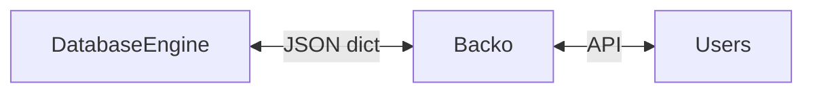
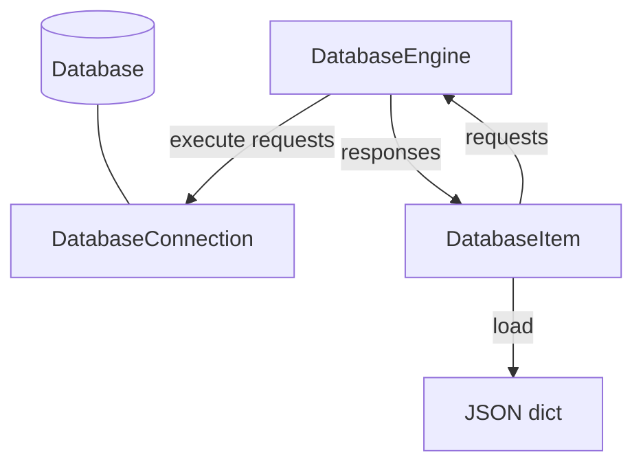

# Database engine architecture

Once an `Item` is defined in Backo, it can receive JSON-like dicts from
`DatabaseEngine`s to initialize `Item`s. Backo then exposes `Item`s through a
generated CRUD API, allowing users to safely and easily perform standard
operations on them.



However, the `DatabaseEngine` can be connected to a database that returns data
that can be very far from the expected JSON dict, for example LDAP trees or SQL
tables.

Moreover, if the `DatabaseEngine` should work from an existing database, it is
very likely that expected attributes of the backo `Item` does not match the
existing database fields. Actually, the ability to translate complex databases
to an easily understandable JSON based CRUD application is a main interest of
Backo.

It is not even guaranteed that the `JSON dict` representing the item can be
retrieved from a single database request. It might be required to perform
several requests to build the final Backo item, especially to handle `Ref`,
`RefList` and so on. You might also define a single Backo item that is an
aggregation of fields from several data sources.

The purpose of the `DatabaseEngine` is to orchestrate database requests to build
the expected `JSON dict`, allowing users to handle complex database schemes of
different nature with a very simple low-code syntax.

For developers, only a few specific features must be implemented to allow the
`DatabaseEngine` to support a new database (e.g. LDAP, SQL, key value
stores...).

# Specifying a DatabaseItem

Here is an example of a Backo `Item`:
```python
user = Item({
        "name": String(),
        "surname": String(),
        "group": Ref(collection="groups", field="$.users", required=True),
    })
```

It defines how `users` will be exposed to actual users through the generated
API, ensure type verification for updates, safe deletion of referenced items and
so on, but it does **not** define how the `name`, `surname`, and `addr` fields
should be retrieved from the database. The `Item` is voluntarily designed to be
independent of the actual database in which it is stored.

All of the database specific mechanics must then be specified in a dedicated
`DatabaseItem`.

To summarize:
- Backo uses `Item`s as a specification of how to expose an API to the final users
- The `DatabaseEngine` uses `DatabaseItem`s as a specification of how to load
  `Item`s from a database

A `DatabaseItem` is a generic structure that might look similar to the
corresponding `Item`, but does not represent the same information. It is based
on two structures:
- `id_mapper`: specifies how a unique backo `_id` can be built from the external
  database, and how the item can be queried later in the database.
- `attributes`: a dict mapping JSON fields to specifications of database
  attributes. Each value describes exactly how to retrieve the value that will
  be associated to the key in the finally produced JSON-like dict. The nature of
  `attributes` can be very specific to the database currently considered.

The following examples will illustrate various usage and implementation.

## A basic example

This is a trivial example, that is used by default by the `YamlDatabaseEngine`.

```python
user_database = DatabaseItem(
        id_mapper=YamlKey(),
        base=YamlObject()
    )
```

The Yaml file (passed as parameter to the `YamlDatabaseEngine`, not represented
here) is expected to represent an object with ids of `Item`s as keys and `Item`s
themselves as values, for example:
```yaml
item1:
  foo: bar
  name: "Item 1"
item2:
  foo: baz
  name: "Item 2"
```

Using `YamlKey()` as the `id_mapper` tells the database engine to use Yaml keys
as identifiers. So the `DatabaseEngine` will consider the Yaml value associated
to the key `item1` when asked for the `Item` with `_id` `item1`. This is applied
for search, creation, update, or any other operation.

Then, the `YamlObject()` used as attributes means that the unserialized Yaml
value associated to the object should be returned as-is to build the JSON-like
dict returned by the engine.

## An other Yaml example with extra features

```python
user_database = DatabaseItem(
        id_mapper=YamlKey(),
        base=YamlObject(),
        attributes={
          "login"= YamlValue("name"),
        }
    )
```

This example is the same as before, but the `YamlValue` field specifies that the
value associated to the key `name` must be used as `login` in the built `Item`.
The base Yaml object is still used as a base for the returned value.

## A simple LDAP example

```python
user_database = DatabaseItem(
        id_mapper=MapDNToID(),
        base=Empty(),
        attributes={
            "name": Attribute("uid"),
            "description": Attribute("description")
        }
    )
```

With this example, the DatabaseItem will load() the JSON-like dict by
loading values of `name` and `description` fields from the `uid` and
`description` attributes of the LDAP response obtained from the result
of the search for the DN associated to the item, that is used as `_id`.

## A complex LDAP example

The following example illustrates how the `DatabaseEngine` can handle complex
database schemes that can be very different from the expected JSON-dict,
contrary to the previous Yaml example.

```python
user_database = DatabaseItem(
        id_mapper=MapDNToID(),
        base=Empty(),
        attributes={
            "name": Attribute("uid"),
            "surname": Attribute("sn"),
            "group": LdapDistantRef(
                id_mapper=RefAttributeId("gidNumber"),
                reverse=ReverseSearch(
                            search_base="ou=groups,cn=example,cn=org", 
                            attribute="name",
                            search_attribute="member"
                            )
            )
        }
    )
```

The `MapDNToID()` `id_mapper` uses the LDAP Distinguished Name (DN) as the backo
ID.

`attributes` are specified as a `dict` that contain all keys expected in the
generated JSON-like dict. 

In this example, `name` and `surname` are stored in the `uid` and `sn` LDAP
attributes of the entry corresponding to the DN.

The `group` is a much more complex field, as it is **not** included in the LDAP
entry representing the `user` `Item`. However, we want to have a `group`
attribute in the Backo `Item` that is a plain `Ref` to an other `Group`
`Item`, so it can be easily retrieved from the `user.group` field in the final
object. The `LdapDistantRef` then specifies to perform an other LDAP request to
search for an entry within the subtree `ou=groups,cn=example,cn=org` with a
`member` LDAP attribute that contain the `name` of the current `user`: this is
the `group` of the user. The `gidNumber` of the found group will then be stored
in the `group` field as the Backo `_id` of the referenced group. This ID can
be used later by Backo to load the associated `group`, if the `groups`
collection as been defined accordingly (i.e. using the `gidNumber` of each
`group` as its Backo `_id`).

The main idea is that the user only needs to provide a description of expected
fields and where to find them, but the execution flow is completely managed by
the `DatabaseEngine`.

# How the DatabaseEngine works




Given a `DatabaseItem`, the `DatabaseEngine` workflow consists in three steps:
1. ask the `DatabaseItem` for requests required to build the representation of
   the item associated to the given `_id`
3. perform those requests against the real database backend using the
   `DatabaseConnection`
4. provide the responses to the `DatabaseItem.load()` method so it can build a
   JSON-like dict representation of the `Item`.

The `DatabaseItem` builds requests using the following procedure:
1. build request required by the `id_mapper` to perform the `base`
   initialization of the `DatabaseItem` instance associated to an `_id`
2. build additional requests required to initialize all `attributes` of the
   `DatabaseItem`.

While the `id_mapper` will provide a single request mapped to a single response
instance, requests required by `attributes` can be as complex as required. The
associated responses will be stored in a structure that mirrors `attributes`.

For example, given the following `attributes`:
```python
{
  "field1": attribute_1,
  "field2": attribute_2,
  "nested_field": {
    "field3": [attribute_3, attribute_4]
  }
}
```

the following set of requests will be built for a `search` operation, where
`base_request=id_mapper.search_request(<id>)` is the request built by the
`id_mapper`:
```python
{
  "field1": attribute_1.search_request(base_request),
  "field2": attribute_2.search_request(base_request),
  "nested_field": {
    "field3": [attribute_3.search_request(base_request), attribute_4.search_request(base_request)]
  }
}
```

This means that each attribute is allowed to either modify the `base_request`,
build a new request or do nothing. For example, the LDAP `Attribute("name")`
will add `"name"` to the LDAP attributes of the base LDAP search query.
`LdapDistantRef` will return a new LDAP search query for all the referenced
items so they can be associated to the item when `LdapDistantRef` is loaded.

Then the `DatabaseEngine` will perform requests using the
`DatabaseConnection.execute_search` method and the results to
`DatabaseItem.load(base_response, attributes_responses)` where `base_response`
is the result of the `base_request` and `attributes_responses` contains the
responses associated to each attribute, organised as follows:
```python
{
  "field1": response_1,
  "field2": response_2,
  "nested_field": {
    "field3": [response_3, response_4]
  }
}
```

This structure allows the `DatabaseItem` to load the value of each field using
the `base_response` and responses of each attribute, so the file JSON-like dict
will be equal to:
```python
{
  "field1": attribute_1.load(base_response, response_1),
  "field2": attribute_2.load(base_response, response_2),
  "nested_field": {
    "field3": [attribute_3.load(base_response, response_3), attribute_4.load(base_response, response_4)]
  }
}
```

Notice that in most cases, only the base `id_mapper` request is enough, and
database attributes will look for values in the base response. The ability to
modify the base request allows to perform a single fined-tuned request, while
still allowing additional requests for complex database attributes. This allows
the `DatabaseEngine` to be very efficient, in spite of an high level of
abstraction.

