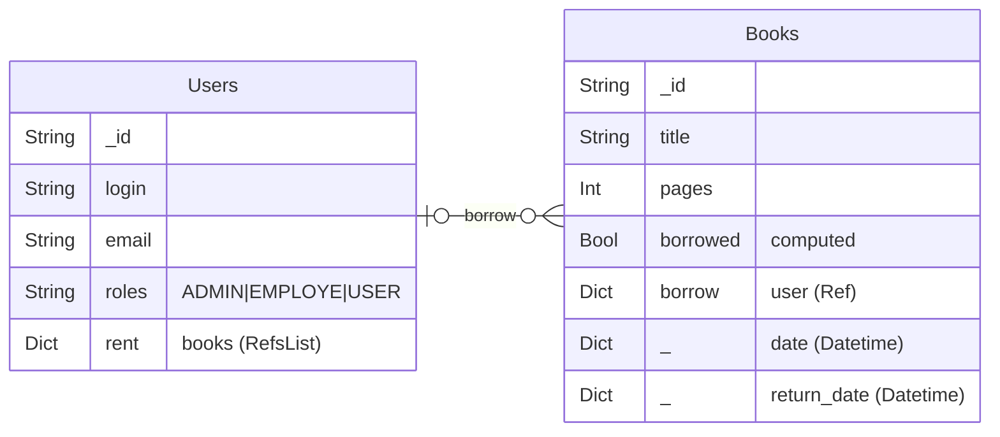

# Media library small example

this is an example of a media library, with this rules :

* About users :
  * There is some users, with roles ```ADMIN```,  ```EMPLOYEE``` or ```USER```, 
  * An ```ADMIN``` can change roles to other user. He can create or delete a user
  * There is a "fake" login procedure (if the password == login => succeed ) *the purpose of this example is not about login procedure and security*
  * If the user doesn't exist in the DB at login, he is added with role ```USER```,
  
* About books :
  * there is some books in the DB. only ```EMPLOYEE``` can create or delete a book.
  * books can be borrowed by users with the following
  * ```EMPLOYEE``` can associate a user with the book he borrow.
  




## Files

### backoffice.py

```backoffice.py``` is the main program. You need a mongodb database

```bash
# As a real API server
python ./backoffice.py

# As test
python -m unittest ./backoffice.py
```

It contains the login procedure and the auth procedure with jwt

### users.py

```Collections/users.py``` is dedicated to **users**

it contain an action **toggle_role** to change the role of a user.

### books.py

```Collections/books.py``` is dedicated to **books**

it contain an action **borrow** to handle borrow of books.


