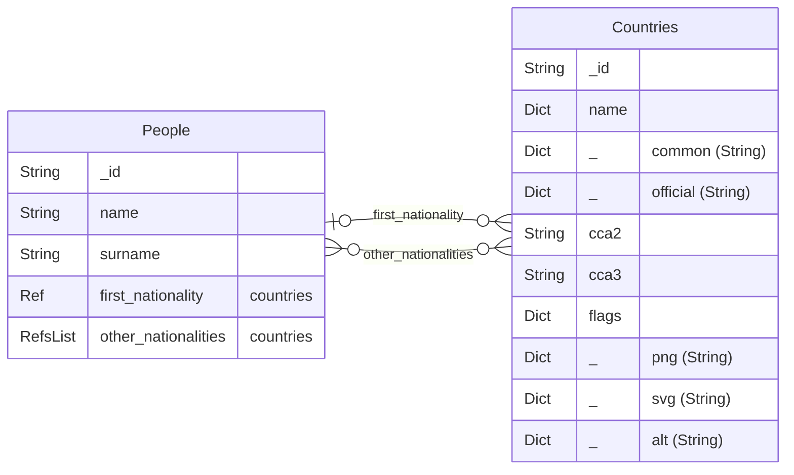

# Media library small example

this is an example of a db connector with a wget

* About peoples :
  * This collection is just here to have Ref and RefsList to tue country collection. 
  * country collection is not in database. It is a wget to a public API,

The database looks like




## Files

### backoffice.py

```backoffice.py``` is the main program. You need a mongodb database

```bash
# As a real API server
python ./backoffice.py

# As test
python -m unittest ./tests.py
```

It contains the login procedure and the auth procedure with jwt

### people.py

```collection_set/people.py``` is dedicated to **people**


### contries.py

```collection_set/contries.py``` is dedicated to **contries**
```collection_set/db_country_connector.py``` is dedicated to map wget to the DB


