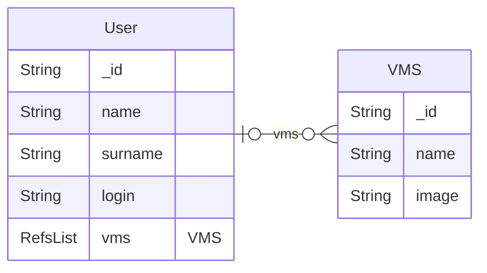

# IT department VMs management

This is an example for a backoffice using a Rest API with a `DBRestfullConnector` connector.

We simulate VMs management for an IT department:
* `users` :
  * This collection is just here to a RefsList to a VMs collection
* `VMs` collection is not in database. It is remote Rest API you can find in the [rest-api](./rest-api/) folder

The database looks like



The remote REST API is reachavalabler at `http://localhost:12345/api/v1/hypervisor/vms` and implements a full CRUD interface using `backo`.


## Files

### backoffice.py

```backoffice.py``` is the main program. You need a mongodb database

```bash
# As a real API server
python ./backoffice.py

# As test
python -m unittest ./tests.py
```

It contains the login procedure and the auth procedure with jwt

### users.py

```collection_set/users.py``` is dedicated to **users**


### vms_connector.py

```collection_set/vms_connector.py``` is dedicated to **vms** collection via a REST API connector


