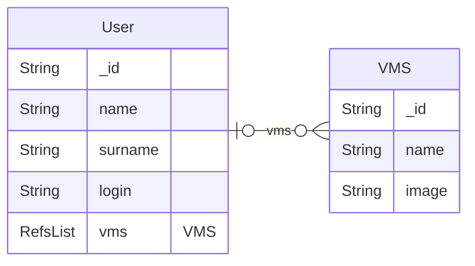

# IT department VMs management

This is an example for a backoffice using a Rest API with a `DBRestfullConnector` connector.

We simulate VMs management for an IT department:
* `users` :
  * This collection is just here to a RefsList to a VMs collection
* `VMs` collection is not in database. It is a remote Rest API (written with `backo`, "backo-ception" style). You can find in the [rest-api](./rest-api/) folder.

The database looks like



The remote REST API is reachavalabler at `http://localhost:12345/api/v1/hypervisor/vms` and implements a full CRUD interface using `backo`.

## Specific Dependencies

In addition to `backo` and its standard dependencies, this example requires:

- `coloredlogs`
- `pymongo`
- `flask_cors`

Install them in your environment:

```bash
pip install coloredlogs pymongo flask-cors
or
pip install -r requirements.txt
```


## Files

### backoffice.py

```backoffice.py``` is the main program. You need a mongodb database

```bash
# As a real API server
python ./backoffice.py

# As test
python -m unittest ./tests.py
```

It contains the login procedure and the auth procedure with jwt

### users.py

```collection_set/users.py``` is dedicated to **users**


### vms_connector.py

```collection_set/vms_connector.py``` is dedicated to **vms** collection via a REST API connector


## DBRestfullConnector

The `DBRestfullConnector` is derivated in the `VMsConnector` class to interact with the [rest-api](./rest-api/) API.

First, init the class specifying how the REST API is accessed, i.e. the base URL to use. By default, this is `http://localhost:12345/api/v1/hypervisor` 

```python
    def __init__(self, **kwargs):
        """constructor"""
        DBRestfullConnector.__init__(
            self,
            host="localhost",
            port=12345,
            tls=False,
            prefix="api/v1/hypervisor",
            **kwargs,
        )
```

In the `DBRestfullConnector`, the different method inherited from `DBConnector` are overwritten to add extra required parameter via `**kwargs` to pass detailed parameters for the requests to the different endpoints.

In `VMsConnector`, we use these extra parameters to tweak each endpoint call.

For example, to get a specific VM we call `DBRestfullConnector.get_by_id` for the `vms` endpoint and desired `_id`:

```python
    def get_by_id(self, _id: str) -> dict:
        """See :func:`DBConnector.get_by_id`"""
        try:
            return super().get_by_id(
                _id,
                endpoint="vms",
            )
        except RestAPIError as e:
            raise e
```

The [vms_connector.py](./collections_set/vms_connector.py) file implements the whole interface with the [rest-api](./rest-api/) REST API.

To use it:
```bash
$ curl http://localhost:5000/api/v1/it/vms
{"result": [], "total": 0, "_skip": 0, "_page": 10}

$ curl -X POST http://localhost:5000/api/v1/it/vms \
    -H "Content-Type: application/json" \
    -d '{"name":"vm-01","image":"debian12"}'
{"name": "vm-01", "image": "debian12", "_id": "16901096973799737815"}

$ curl http://localhost:5000/api/v1/it/vms
{"result": [{"name": "vm-01", "image": "debian12", "_id": "16901096973799737815"}], "total": 1, "_skip": 0, "_page": 10}
$ curl -X GET http://localhost:12345/api/v1/hypervisor/vms
{"result": [{"name": "vm-01", "image": "debian12", "_id": "16901096973799737815"}], "total": 1, "_skip": 0, "_page": 10}

$  curl -X GET http://localhost:5000/api/v1/it/vms/16901096973799737815
{"name": "vm-01", "image": "debian12", "_id": "16901096973799737815"}

$ curl -X DELETE http://localhost:12345/api/v1/hypervisor/vms/16901096973799737815
deleted
$ curl http://localhost:5000/api/v1/it/vms
{"result": [], "total": 0, "_skip": 0, "_page": 10}
```

